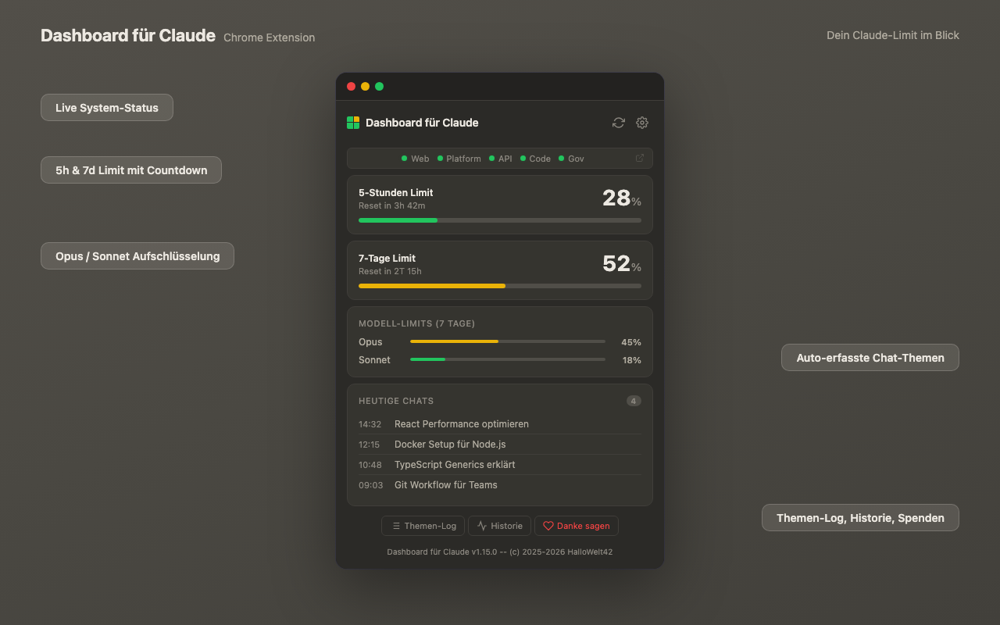

# Dashboard fuer Claude

Browser-Extension zur Anzeige deines Claude-Nutzungslimits.



## Features

- **Dynamisches Badge** - Zeigt 5h-Verbrauch als Donut-Diagramm mit Prozent
- **5-Stunden Limit** - Aktueller Verbrauch + Live-Countdown bis Reset
- **7-Tage Limit** - Wochenverbrauch mit Modell-Aufschluesselung (Opus/Sonnet)
- **System-Status** - Live-Status von Web, API, Console (via status.claude.com)
- **Themen-Log** - Erfasst Chat-Titel automatisch
- **Auto-Sync** - Aktualisiert alle 5 Minuten
- **Verbrauchs-Historie** - Verlauf der Limit-Auslastung
- **Privat** - Alle Daten bleiben lokal, kein Tracking

## Voraussetzungen

- **Claude Pro** oder **Max** Abo
- **Brave** oder **Chrome** Browser
- Auf [claude.ai](https://claude.ai) eingeloggt

## Installation

### Chrome Web Store
Direkt aus dem Chrome Web Store installieren.

### Manuell (Entwicklermodus)
1. Repository herunterladen/klonen
2. `chrome://extensions` öffnen
3. **Entwicklermodus** aktivieren (Schalter oben rechts)
4. **"Entpackte Erweiterung laden"** klicken
5. Den `claude-dashboard` Ordner auswählen

## Verwendung

### Erste Einrichtung
1. Oeffne [claude.ai](https://claude.ai) und logge dich ein
2. Klicke auf das Extension-Icon
3. Klicke auf Sync - die Daten werden automatisch geladen

### Badge lesen
- **Zahl im Donut** = 5h-Verbrauch in %
- **Gruen** (0-39%) = Viel Kapazitaet
- **Gelb** (40-74%) = Moderat
- **Rot** (75-100%) = Fast am Limit

### Status-Anzeige
Die Punkte im Popup zeigen den Live-Status der Claude-Dienste:
- Gruen = Betriebsbereit
- Gelb = Eingeschraenkt
- Rot (pulsierend) = Ausfall
- Blau = Wartung

Klicke auf **?** fuer die vollstaendige Legende.

## Dateistruktur

```
claude-dashboard/
  manifest.json          Extension-Config (MV3)
  background/
    service-worker.js    API-Calls, Badge, Status-Sync
  content/
    topic-collector.js   Chat-Titel erfassen
  popup/                 Popup-Hauptansicht
  pages/                 Settings, Themen-Log, Historie, Spenden
  icons/                 Extension-Icons
```

## Datenschutz

- Keine externen Server (ausser claude.ai API und status.claude.com)
- Alle Daten lokal im Browser gespeichert
- Kein Tracking, keine Analytics
- Open Source - Code jederzeit einsehbar

➡️ [Vollständige Datenschutzerklärung](PRIVACY.md)

## Unterstützen

Dashboard fuer Claude ist ein privates Open-Source-Projekt. Kein Tracking, keine Werbung, keine Kompromisse.

Wenn dir das Projekt gefällt, kannst du über den ❤️-Button im Popup "Danke sagen" -  oder direkt hier:

[](https://ko-fi.com/HalloWelt42)


**Crypto:**

| Coin | Adresse |
| ------ | --------- |
| BTC | `bc1qnd599khdkv3v3npmj9ufxzf6h4fzanny2acwqr` |
| DOGE | `DL7tuiYCqm3xQjMDXChdxeQxqUGMACn1ZV` |
| ETH | `0x8A28fc47bFFFA03C8f685fa0836E2dBe1CA14F27` |

---

## Lizenz

**Nicht-kommerzielle Nutzung** -  Siehe [LICENSE](LICENSE)

✅ Private Nutzung, Installation, persönliche Anpassungen, Teilen mit Quellenangabe

❌ Kommerzielle Nutzung, Verkauf, Einbindung in kommerzielle Produkte

---

## Support

- 🐛 Bugs & Features: [GitHub Issues](https://github.com/HalloWelt42/claude-limit-chrome-addon/issues)
- ☕ Unterstützen: [Ko-fi](https://ko-fi.com/HalloWelt42)

---

© 2025-2026 [HalloWelt42](https://github.com/HalloWelt42) — Nicht-kommerzielle Nutzung / Non-commercial use only
